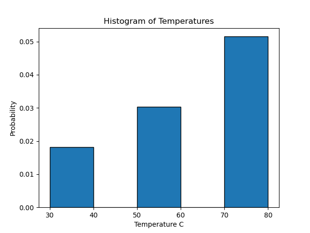
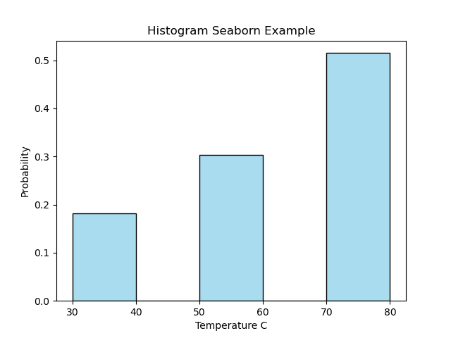
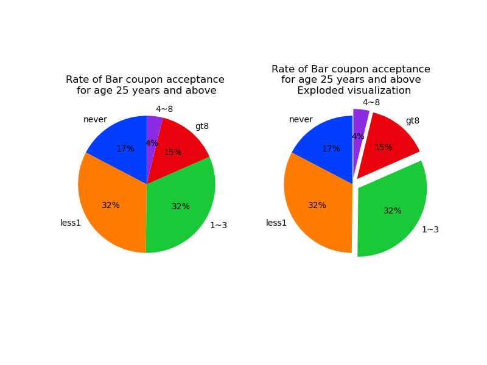
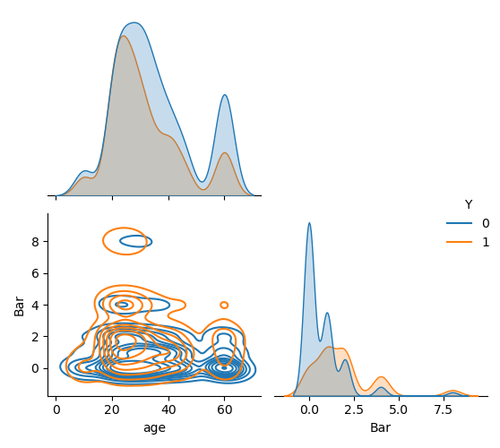
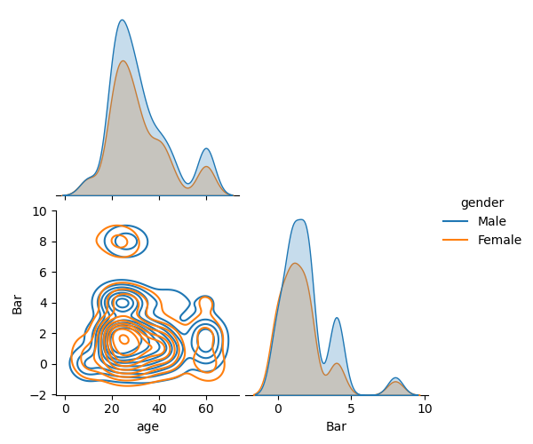
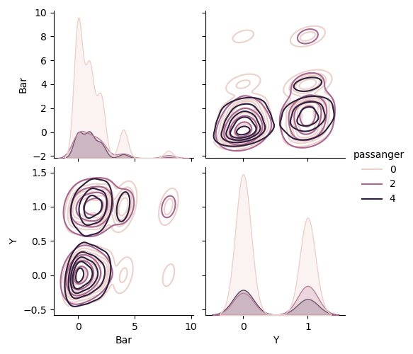
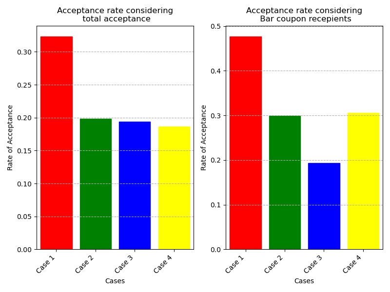
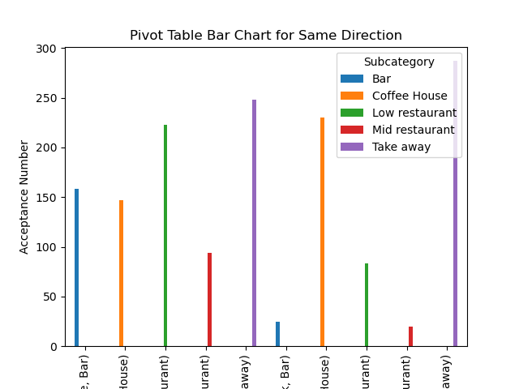
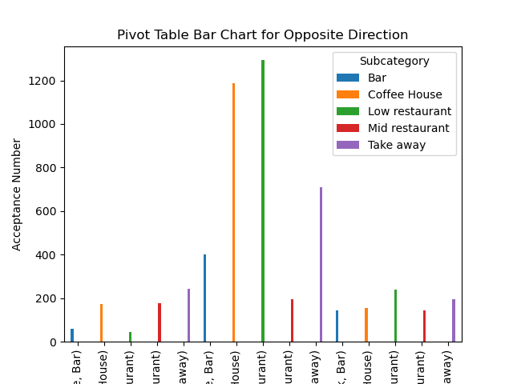
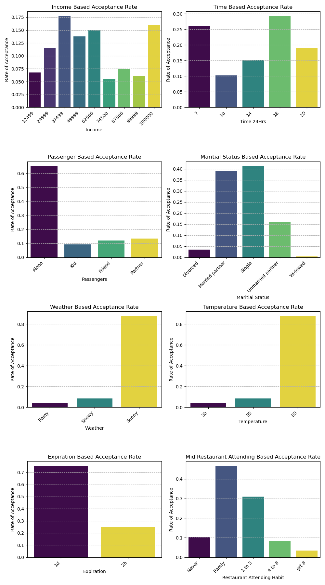

# Project Report for Practical Application Assignment 5.1

## Introduction

Imagine driving through town and receiving a coupon on your cell phone for a nearby restaurant. This scenario is becoming increasingly common with the advent of location-based services and mobile marketing. In this report, we examine the tendencies of drivers to accept coupons for bars and mid-level restaurants while they are on the road.

## Overview
The goal of this project is to leverage visualizations and probability distributions to distinguish between customers who accepted a driving coupon and those who did not. By analyzing the data, we aim to uncover patterns and factors that influence a driver's decision to accept or reject a coupon.

## Data
The data for this project is sourced from the UCI Machine Learning repository and was collected via a survey on Amazon Mechanical Turk. The survey presents various driving scenarios, including details such as the destination, current time, weather, and passengers. Participants were asked whether they would accept a coupon if they were the driver. Responses indicating that the user would drive to the location 'right away' or 'later before the coupon expires' are labeled as 'Y = 1', while responses indicating 'no, I do not want the coupon' are labeled as 'Y = 0'. The dataset includes five different types of coupons: less expensive restaurants (under $20), coffee houses, carry out & take away, bars, and more expensive restaurants ($20 - $50).

The provided DataFrame contains 12,684 entries and 26 columns. Below is a summary of the columns, their data types, and the number of non-null entries for each column:

**DataFrame Information**

- **Total Entries**: 12,684
- **Total Columns**: 26

**Column Details**

| #   | Column                | Non-Null Count | Dtype  |
|-----|------------------------|----------------|--------|
| 0   | destination            | 12,684         | object |
| 1   | passanger              | 12,684         | object |
| 2   | weather                | 12,684         | object |
| 3   | temperature            | 12,684         | int64  |
| 4   | time                   | 12,684         | object |
| 5   | coupon                 | 12,684         | object |
| 6   | expiration             | 12,684         | object |
| 7   | gender                 | 12,684         | object |
| 8   | age                    | 12,684         | object |
| 9   | maritalStatus          | 12,684         | object |
| 10  | has_children           | 12,684         | int64  |
| 11  | education              | 12,684         | object |
| 12  | occupation             | 12,684         | object |
| 13  | income                 | 12,684         | object |
| 14  | car                    | 108            | object |
| 15  | Bar                    | 12,577         | object |
| 16  | CoffeeHouse            | 12,467         | object |
| 17  | CarryAway              | 12,533         | object |
| 18  | RestaurantLessThan20   | 12,554         | object |
| 19  | Restaurant20To50       | 12,495         | object |
| 20  | toCoupon_GEQ5min       | 12,684         | int64  |
| 21  | toCoupon_GEQ15min      | 12,684         | int64  |
| 22  | toCoupon_GEQ25min      | 12,684         | int64  |
| 23  | direction_same         | 12,684         | int64  |
| 24  | direction_opp          | 12,684         | int64  |
| 25  | Y                      | 12,684         | int64  |

**Data Types**

- **int64**: 8 columns
- **object**: 18 columns

**Memory Usage**

- **Total Memory Usage**: 2.5+ MB

### Data Description
Keep in mind that these values mentioned below are average values.

The attributes of this data set include:
1. User attributes
    -  Gender: male, female
    -  Age: below 21, 21 to 25, 26 to 30, etc.
    -  Marital Status: single, married partner, unmarried partner, or widowed
    -  Number of children: 0, 1, or more than 1
    -  Education: high school, bachelors degree, associates degree, or graduate degree
    -  Occupation: architecture & engineering, business & financial, etc.
    -  Annual income: less than \\$12500, \\$12500 - \\$24999, \\$25000 - \\$37499, etc.
    -  Number of times that he/she goes to a bar: 0, less than 1, 1 to 3, 4 to 8 or greater than 8
    -  Number of times that he/she buys takeaway food: 0, less than 1, 1 to 3, 4 to 8 or greater
    than 8
    -  Number of times that he/she goes to a coffee house: 0, less than 1, 1 to 3, 4 to 8 or
    greater than 8
    -  Number of times that he/she eats at a restaurant with average expense less than \\$20 per
    person: 0, less than 1, 1 to 3, 4 to 8 or greater than 8
    -  Number of times that he/she goes to a bar: 0, less than 1, 1 to 3, 4 to 8 or greater than 8

2. Contextual attributes
    - Driving destination: home, work, or no urgent destination
    - Location of user, coupon and destination: we provide a map to show the geographical
    location of the user, destination, and the venue, and we mark the distance between each
    two places with time of driving. The user can see whether the venue is in the same
    direction as the destination.
    - Weather: sunny, rainy, or snowy
    - Temperature: 30F, 55F, or 80F
    - Time: 10AM, 2PM, or 6PM
    - Passenger: alone, partner, kid(s), or friend(s)

3. Coupon attributes
    - time before it expires: 2 hours or one day
    - 
### Key Points
- The DataFrame is relatively large, with 12,684 entries and 26 columns.
- Most columns have complete data, but the car column has significant missing values (only 108 non-null entries).
- The columns include a mix of categorical (object) and numerical (int64) data types.
- The target variable Y indicates whether the coupon was accepted (1) or not (0).
This summary provides an overview of the structure and completeness of the dataset, which is essential for further analysis and modeling.

## Methodology

The dataset was first cleaned and preprocessed to handle missing values and outliers. Feature engineering was performed to create new variables that could potentially improve the model's performance. 
- Improvements such as removing nulls and blank data sets
- Removing Car column due to mostly blank
- Replacing some categorical values with numerical values to assis t in seraches and correlations

## Results
## Answering questions in the notebook
**1.** Read in the coupons.csv file. <br>
**2.** Investigate the dataset for missing or problematic data. <br>
- such investigation revealed that the folowing columns had nulls and the particular columns where removed.

```
car                     12576
Bar                       107
CoffeeHouse               217
CarryAway                 151
RestaurantLessThan20      130
Restaurant20To50          189
```
**3.** Decide what to do about your missing data -- drop, replace, other ...
- The decision was to drop Car column and remove the null rows from the other 5 columns
- 42 of missiing out eating habits are missing on all categories.</b> Those we can eliminate 42/12500
- There doesn't seem to be correlation between other answers and other occasionals so we just eliminate all rows containing them. They are only less than 7% of the data.
- Alternatively, we can eliminate them one by one when using the particular data

- The final data set had the following data:
```
    <class 'pandas.core.frame.DataFrame'>
    Index: 12079 entries, 22 to 12683
    Data columns (total 25 columns):
     #   Column                Non-Null Count  Dtype 
    ---  ------                --------------  ----- 
     0   destination           12079 non-null  object
     1   passanger             12079 non-null  object
     2   weather               12079 non-null  object
     3   temperature           12079 non-null  int64 
     4   time                  12079 non-null  object
     5   coupon                12079 non-null  object
     6   expiration            12079 non-null  object
     7   gender                12079 non-null  object
     8   age                   12079 non-null  object
     9   maritalStatus         12079 non-null  object
     10  has_children          12079 non-null  int64 
     11  education             12079 non-null  object
     12  occupation            12079 non-null  object
     13  income                12079 non-null  object
     14  Bar                   12079 non-null  object
     15  CoffeeHouse           12079 non-null  object
     16  CarryAway             12079 non-null  object
     17  RestaurantLessThan20  12079 non-null  object
     18  Restaurant20To50      12079 non-null  object
     19  toCoupon_GEQ5min      12079 non-null  int64 
     20  toCoupon_GEQ15min     12079 non-null  int64 
     21  toCoupon_GEQ25min     12079 non-null  int64 
     22  direction_same        12079 non-null  int64 
     23  direction_opp         12079 non-null  int64 
     24  Y                     12079 non-null  int64 
```
**4.** What proportion of the total observations chose to accept the coupon?

| Total Coupons | Accepted Coupons| Accepted percentile |
|---------------|-----------------|---------------------|
| 12079         | 6877            | %56.933             |

**5.1** Use a bar plot to visualize the `coupon` column.

- The data in the bar chart is:
| Coupon          | Count |
|-----------------|-------|
| Coffee House    | 3816  |
| Low restaurant  | 2653  |
| Take away       | 2280  |
| Bar             | 1913  |
| Mid restaurant  | 1417  |

- ***a)*** Created a dedicated function for applying colors, making the code more reusable and maintainable
- ***b)*** Added descriptive docstring explaining the function's purpose and parameters
- ***c)*** Used `zip()` instead of `enumerate()` since we don't need the index
- ***d)*** Separated the color definition from the application logic
- ***e)*** Use a histogram to visualize the temperature column.

- I depcted it using Matlibplot histogram, the code can be found in the Jupiter notebook and the histogram is depicted below:

- I depcted it using Seaborn histogram as well, the code can be found in the Jupiter notebook and the histogram is depicted below:


**Investigating the Bar Coupons** <br>
***5.2*** Create a new `DataFrame` that contains just the bar coupons.
- This dataframe would have the following columns and rows:
```

    <class 'pandas.core.frame.DataFrame'>
    Index: 1913 entries, 24 to 12682
    Data columns (total 25 columns):
     #   Column                Non-Null Count  Dtype 
    ---  ------                --------------  ----- 
     0   destination           1913 non-null   object
     1   passanger             1913 non-null   object
     2   weather               1913 non-null   object
     3   temperature           1913 non-null   int64 
     4   time                  1913 non-null   object
     5   coupon                1913 non-null   object
     6   expiration            1913 non-null   object
     7   gender                1913 non-null   object
     8   age                   1913 non-null   object
     9   maritalStatus         1913 non-null   object
     10  has_children          1913 non-null   int64 
     11  education             1913 non-null   object
     12  occupation            1913 non-null   object
     13  income                1913 non-null   object
     14  Bar                   1913 non-null   object
     15  CoffeeHouse           1913 non-null   object
     16  CarryAway             1913 non-null   object
     17  RestaurantLessThan20  1913 non-null   object
     18  Restaurant20To50      1913 non-null   object
     19  toCoupon_GEQ5min      1913 non-null   int64 
     20  toCoupon_GEQ15min     1913 non-null   int64 
     21  toCoupon_GEQ25min     1913 non-null   int64 
     22  direction_same        1913 non-null   int64 
     23  direction_opp         1913 non-null   int64 
     24  Y                     1913 non-null   int64 
    dtypes: int64(8), object(17)
    memory usage: 388.6+ KB
```    
***5.3***. What proportion of bar coupons were accepted?
| Total Bar Coupons | Accepted Coupons| Accepted percentile |
|-------------------|-----------------|---------------------|
| 1913              | 788             | %41.19              |

***5.4*** Compare the acceptance rate between those who went to a bar 3 or fewer times a month to those who went more.

| Description                                      | Value              |
|--------------------------------------------------|--------------------|
| Accepted < 3 times/month                         | 641                |
| Acceptance rate < 3 times/month                  | 0.8134517766497462 |
| Accepted > 3 times/month                         | 147                |
| Acceptance rate > 3 times/month                  | 0.1865482233502538 |

***5.5*** Compare the acceptance rate between drivers who go to a bar more than once a month and are over the age of 25 to the all others.  Is there a difference?
-The pie chart below which is shown in two different formats (Exploded and as a whole), shows the maority of 25 year sand older that accepted the coupon do not go to Bar frequently. 



- an Age-Bar correlation shows that age and Bar acceptance are not correlated. Hence, comparing different age groups may not be useful.
  |       | age       | Bar       |
|-------|-----------|-----------|
| age   | 1.000000  | -0.077277 |
| Bar   | -0.077277 | 1.000000  |
- The pair plot of such comparison shows, there are higher rate of rejecting the coupon on older drivers but the value is not convincing. The acceptence is also tilted twards the younger age group.
  
- Also It seems more men than women in any age group would accept the Bar coupon. 


***5.6*** Use the same process to compare the acceptance rate between drivers who go to bars more than once a month and had passengers that were not a kid and had occupations other than farming, fishing, or forestry.

- The correlation on passengers with kid eliminated from correlation shows strong tendency to go alone

|            | Bar       | Passenger | Y        |
|------------|-----------|-----------|----------|
| **Bar**    | 1.000000  | 0.004127  | 0.352512 |
| **Passenger** | 0.004127  | 1.000000  | 0.028462 |
| **Y**      | 0.352512  | 0.028462  | 1.000000 |
- The pairplot below also shows a larger portion to go alone and more seldome Bar attenders  would accept the couponsS


***6.*** Compare the acceptance rates between those drivers who:

- go to bars more than once a month, had passengers that were not a kid, and were not widowed *OR*
- go to bars more than once a month and are under the age of 30 *OR*
- go to cheap restaurants more than 4 times a month and income is less than 50K.

## Question six issues:
Surprisingly, we still have vague questions, possibly in the examiner's mind; questions six and seven come together. Question six does not mention that the goal is to find the statistics mentioned on the Bar coupon recipients. Hence, general acceptance rates could be evaluated.
Question seven on the other hand asks for the hypothesis of the Bar Interestingly, there are still some unclear questions that may be lingering in the examiner's mind, particularly regarding questions six and seven, which are closely related. 

Question six does not explicitly state that the goal is to find the statistics related to Bar coupon recipients. Therefore, it could also lead to the evaluation of general acceptance rates. 

On the other hand, question seven asks for the hypothesis concerning Bar coupon acceptors, suggesting two potential interpretations. One interpretation focuses on Bar coupon acceptors, while the other implies that, despite question six being an independent inquiry, students should also consider the hypothesis related to Bar coupon acceptors.

Consequently, question six, while more likely linked to Bar coupon acceptance, should be approached with both conditions in mind.coupon acceptors, hinting at two possibilities. One question is about bar coupon acceptors, and two, despite question six being an independent question, the students should evaluate the hypothesis asked for bar coupon acceptors.

Hence, question six, despite the higher probability of being related to Bar coupon acceptance, is solved with both conditions in mind.

### 1st if the whole data is considered without the Bar coupon specifically in mind:
We could have done it the same way as  we did with question five and change the objects to numerical values that can be searched easier. But here we practice the <b> "in" </b> and <b> "not in" </b> in the query and avoid the change.

| Description                              | Number of Acceptances |
|------------------------------------------|-----------------------|
| Bar > once, not widowed, no kid passenger| 2225                  |
| Bar > once, age < 30                     | 1364                  |
| Cheap restaurant 4x, income < 50k        | 1334                  |
| Driving alone                            | 1283                  |
| Total acceptance                         | 6877                  |

### 2nd considering that the questions are about the Bar coupon receipients
If the question is about Bar coupon receients, we can use the data that we have already filtered in question four and five.
We write the questions again:
- <b> Case 1:</b> Go to bars more than once a month, had passengers that were not a kid, and were not widowed *OR*
- <b> Case 2:</b> Go to bars more than once a month and are under the age of 30 *OR*
- <b> Case 3:</b> Go to cheap restaurants more than 4 times a month and income is less than 50K.
- <b> Case 4:</b> Driving alone

<b>This time consider that they drivers are Bar coupon reciepients</b>
- also reminder: <b> #dfBar are the drivers in data that received Bar coupon as in dfBar = data[data['coupon'].str.contains('Bar')] </b>
- We already have replaced Bar attendance, passenger (passanger) and age to integers to use in search and correleate it.

| Description                              | Number of Acceptances |
|------------------------------------------|-----------------------|
| Bar > once, not widowed, no kid passenger| 376                   |
| Bar > once, age < 30                     | 236                   |
| Cheap restaurant 4x, income < 50k        | 152                   |
| Driving alone                            | 241                   |
| Total acceptance                         | 788                   |
- Figure below shows both 1st and 2nd assumption in a subplot. On Left hand side you see total acceptance and aon right hand side you see Bar coupon acceptance with the three conditions mentioned.


***7.***  Based on these observations, what do you hypothesize about drivers who accepted the bar coupons?

## Hypothesis
- Drivers with moderate income with suitable company would more likely accept the coupons whatever they are. This holds true as well for Bar coupons. 
- They tend to accept the coupon if not widowed and have no kid with them.

# Independent Investigation

Using the bar coupon example as motivation, you are to explore one of the other coupon groups and try to determine the characteristics of passengers who accept the coupons.  
- I divide the independant investigation into two parts, one regarding the direction of travel and distance to the coupon an dthe other about the acceptance rae for mid level restaurants.
## Direction of travel and coupon timing affect
- lets see if direction and time to coupon has any effect
#### Distribution of acceptances within 5 minutes of destination in same direction

| Destination | Coupon         | Count |
|-------------|----------------|-------|
| Home        | Bar            | 158   |
| Home        | Coffee House   | 147   |
| Home        | Low restaurant | 223   |
| Home        | Mid restaurant | 94    |
| Home        | Take away      | 248   |
| Work        | Bar            | 25    |
| Work        | Coffee House   | 230   |
| Work        | Low restaurant | 83    |
| Work        | Mid restaurant | 20    |
| Work        | Take away      | 287   |

#### Distribution of acceptances within 15 minutes of destination in same direction

| Destination | Coupon         | Count |
|-------------|----------------|-------|
| Home        | Bar            | 22    |
| Home        | Coffee House   | 14    |
| Home        | Low restaurant | 14    |
| Home        | Mid restaurant | 24    |
| Home        | Take away      | 133   |
| Work        | Bar            | 25    |
| Work        | Coffee House   | 63    |
| Work        | Take away      | 82    |
- Bar chart below shows the coupons based on same direction

#### Distribution of acceptances within 5 minutes of destination in Opposite direction

| Destination     | Coupon         | Count |
|-----------------|----------------|-------|
| Home            | Bar            | 60    |
| Home            | Coffee House   | 175   |
| Home            | Low restaurant | 43    |
| Home            | Mid restaurant | 177   |
| Home            | Take away      | 243   |
| No Urgent Place | Bar            | 400   |
| No Urgent Place | Coffee House   | 1187  |
| No Urgent Place | Low restaurant | 1293  |
| No Urgent Place | Mid restaurant | 196   |
| No Urgent Place | Take away      | 709   |
| Work            | Bar            | 145   |
| Work            | Coffee House   | 155   |
| Work            | Low restaurant | 239   |
| Work            | Mid restaurant | 145   |
| Work            | Take away      | 195   |

#### Distribution of acceptances within 15 minutes of destination in Opposite direction

| Destination     | Coupon         | Count |
|-----------------|----------------|-------|
| Home            | Bar            | 59    |
| Home            | Coffee House   | 74    |
| Home            | Low restaurant | 43    |
| Home            | Mid restaurant | 141   |
| Home            | Take away      | 97    |
| No Urgent Place | Bar            | 258   |
| No Urgent Place | Coffee House   | 588   |
| No Urgent Place | Low restaurant | 639   |
| No Urgent Place | Mid restaurant | 84    |
| No Urgent Place | Take away      | 604   |
| Work            | Bar            | 141   |
| Work            | Coffee House   | 155   |
| Work            | Low restaurant | 72    |
| Work            | Mid restaurant | 145   |
| Work            | Take away      | 140   |

#### Distribution of acceptances within 25 minutes of destination in Opposite direction

| Destination | Coupon         | Count |
|-------------|----------------|-------|
| Home        | Bar            | 48    |
| Home        | Coffee House   | 22    |
| Home        | Low restaurant | 41    |
| Home        | Mid restaurant | 4     |
| Home        | Take away      | 65    |
| Work        | Bar            | 141   |
| Work        | Coffee House   | 80    |
| Work        | Low restaurant | 56    |
| Work        | Mid restaurant | 44    |
| Work        | Take away      | 125   |

-Bar chart below shows coupons     


## Hypothesis
### Direction of driving influence on coupon acceptance
- Direction of driving has an affect on how the drivers accept coupons and which coupons they accept.
In direction of driving, drivers are more likely tend to accept take aways when they are driving home or to work
- I opposite direction of driving, drivers hardly respond to anything on the way to home or work. In case the drivers ar ein no hurry to go anywere particular, low end restaurants, coffee houses and take aways have high chances of acceptance.
- Base don this study, my suggestion is to always send take away coupons or coffee house coupons on working hours (early mornings) and during the evening when it is most likely to have commuters to work and home. On the weekends, were people are less busy, low end restaurants is a good option and more likely to be accepted.
- The field  of 5 min away from coupon destination has no information. Meaning, being 5 minutes away does not define which coupon the driver accepts.
- Contrary to the 5 min coupon, the 15 and 25 min coupon have significant effect. If the driver is  driving towards home or work, he would not be accepting any coupon that is 25 min away.
- If he is 15 min away from the coupon destination and in opposite direction. He would likely accept if he has nothing to do. Hence it is important to only send coupons that are 5min or 15 min away, within the direction of the driver.

# Expensive Restuarant Coupon and Charachterisation of Passengers
- Pick all drivers receiving mid level restaurant
- Find the acceptance rate for mid level restaurant
- Find the income correlation of accepting mid level restaurant coupon
- Find the passanger correlation on mid level restaurant
- Use all simplification made by replacing the category with numbers


| Description                           | Value                |
|---------------------------------------|----------------------|
| Total Mid Restaurant coupons          | 1417                 |
| Accepted Mid Restaurant coupons       | 632                  |
| % of accepted Mid Restaurant coupons  | %44.60 |

- barplots below show the tendency of accepting mid restaurant coupon on different categories




# Hypothesis
- It is important to send coupons that have greater expiration time. One day expiration rate has 3 times higher acceptance rate than a two hour expiry date
- People who rarely go to mid priced restaurants tend to accept the coupons at higher rate.
- Drivers tend to accept the coupons on a hot sunny day rather than a gloomy rainy day. The rate is above 80 percent.
- Single and unmarried drivers with a partner tend to accept the coupon at higher rate. The tend to accept it at much higher rate if they are alone in the car. Perhaps thinking about their partner when accepting it.
- Mid level restaurants tend to attract mid level incomes or a very high income drivers. It is unkown why high income and abiove 100K accept it.
- Drivers tend to accept the coupon very early in the morning or in the evening.
## Suggestion based on the facts
- Base don the above information, one should target lone drivers that are single or unmarried in a sunny hot day with coupons with expiry date greater than a day. A driver that attend mid level restaurants occasonally or never at all, tend to accept the coupon less, thus targeting drivers that rarely attend restaurants is a better approach. Also it is better to send dthese coupons in teh afternoon or early morning.


